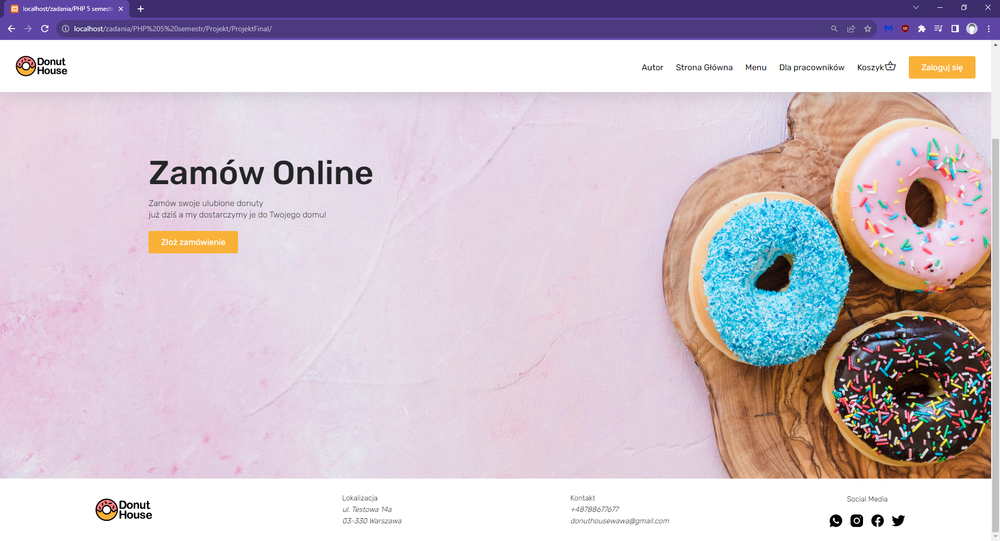
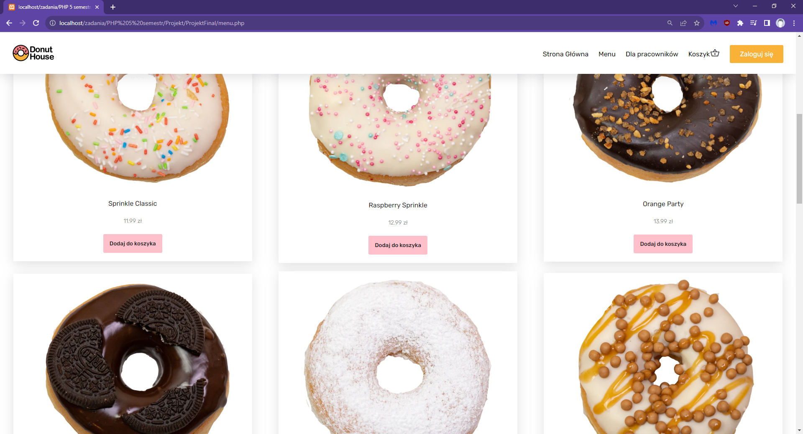
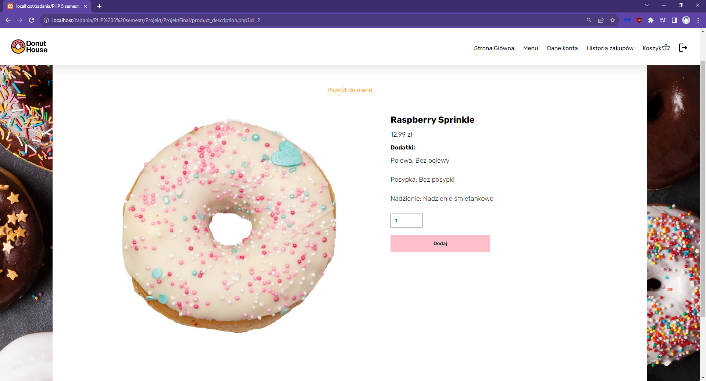
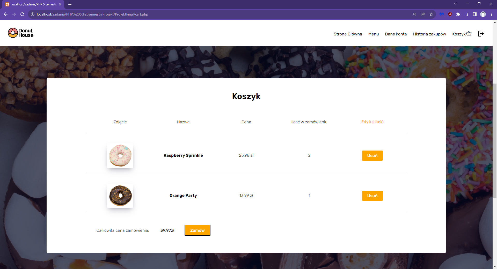
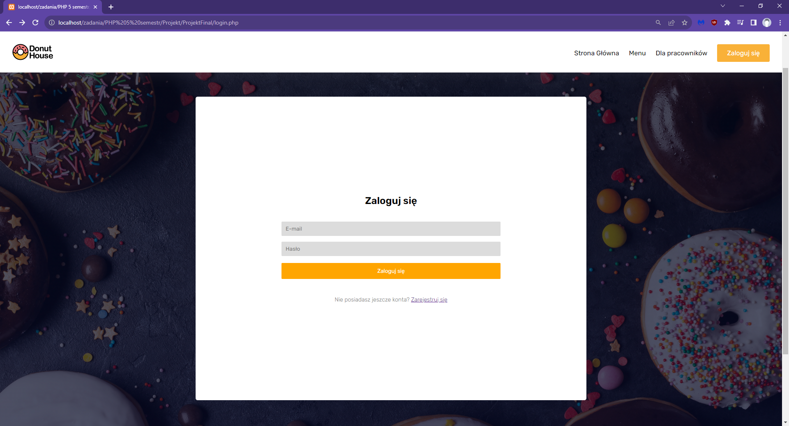
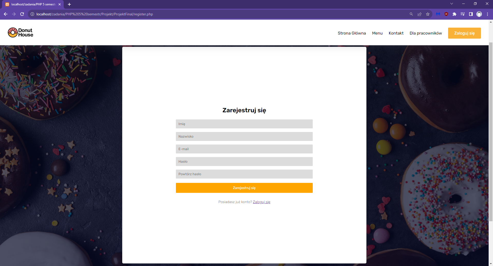
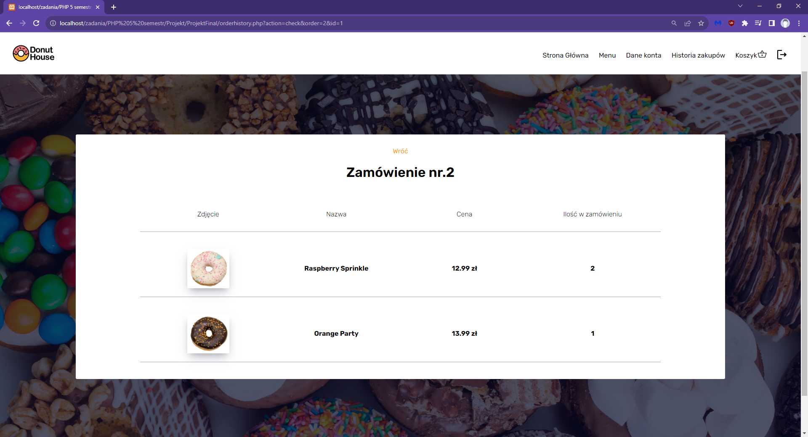
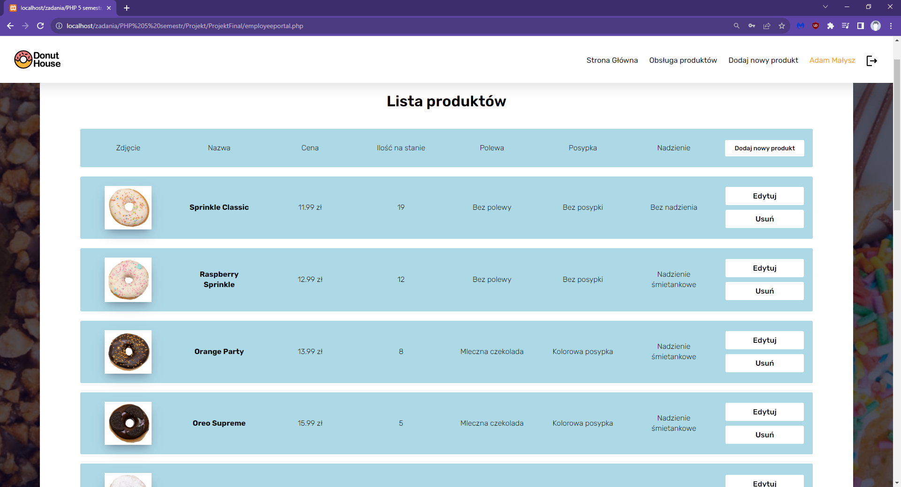
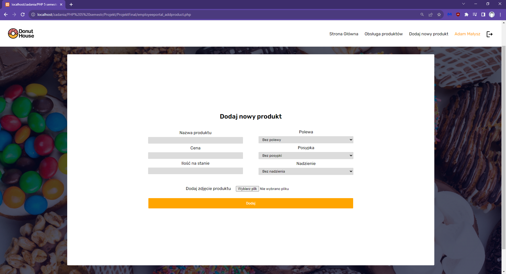
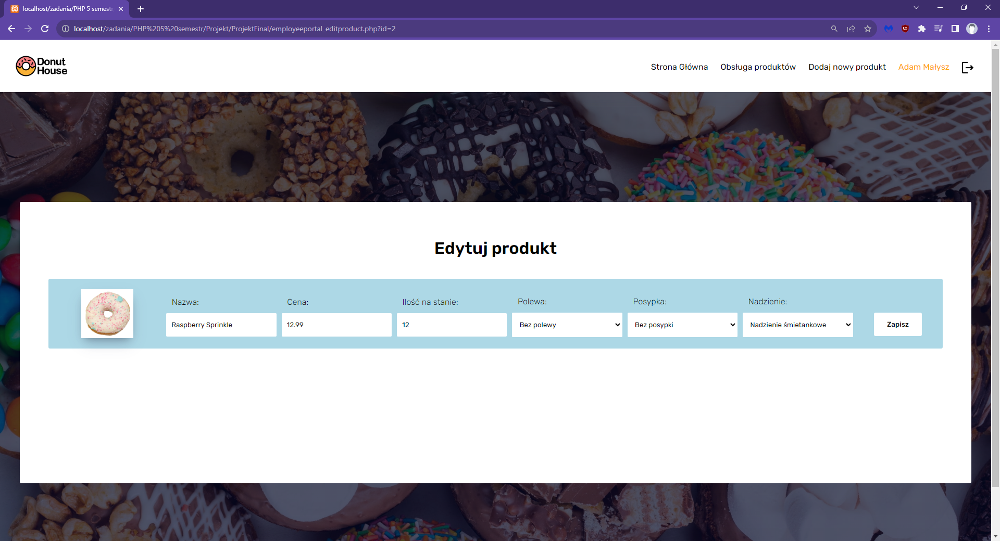

# Bakery
"Bakery" internetowa aplikacja obsługująca sklep z pączkami, stworzona na potrzeby projektu szkolnego.

## Wykorzystane technologie:

**Frontend**
- HTML/CSS

**Backend**
- PHP
- MySQL

## Opis aplikacji:

**Funkcje aplikacji:**
- Logowanie/Rejestracja
- Zarządzanie kontem użytkownika
- Przeglądanie złożonych zamówień
- Składanie zamówień (Koszyk)
- Przeglądanie produktów
- Wyszukiwanie produktów
- Zarządzanie danymi w aplikacji (wersja dla pracownika)

## Wygląd aplikacji:

Obraz 1. Główna strona aplikacji.

----

Obraz 2. Strona z produktami.

----

Obraz 3. Szczegóły danego produktu.

----

Obraz 4. Koszyk

----

Obraz 5. Logowanie

----

Obraz 6. Rejestracja

----

Obraz 7. Historia zamówień użytkownika

----

Obraz 8. Panel pracownika

----

Obraz 9. Nowy produkt

----

Obraz 10. Edycja produktu

